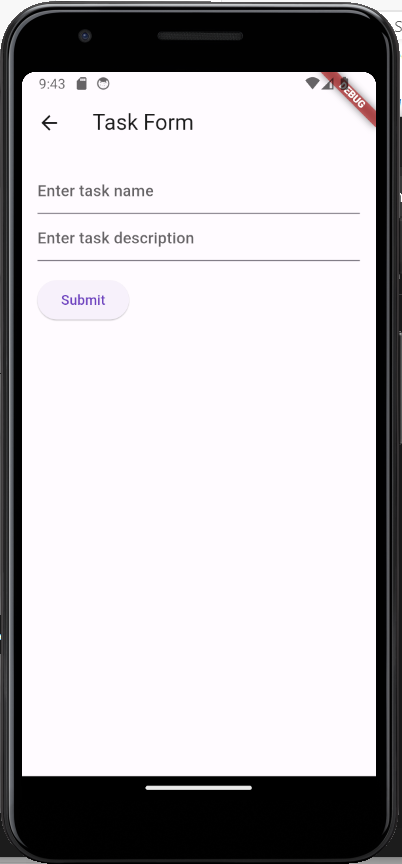
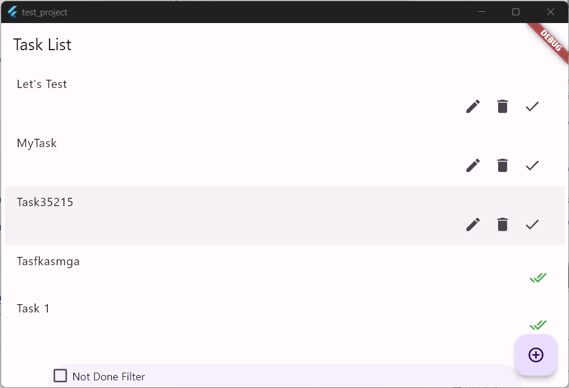

# Description
This app allows us to store different tasks

# Features
* Add New task and description with open status.
* Delete task which is created by mistake.
* Update faulty information in task.
* Once task is done you check-mark as done.
* Filter only open task to see what needs to done.

## Getting Started
You can install flutter by referring following link.
* https://docs.flutter.dev/get-started/install

Note: We need to add the Back4App keys to the main.dart file in lib folder (ping me for the keys +91-8802952380)

To start this project on localhost. do as following:
1. Clone the project on your local system.
2. Open command prompty at project location in your system.
3. Write following command.
    1. <code> PS> flutter pub get </code>
4. Run following commands to see emulators/devices.
    1. <code> PS> flutter devices </code>
    2. <code> PS> flutter emulators</code>
5. Let's start android emulator.
    1. <code> PS> flutter emulators --launch <emulator_name> </code>
7. To run application on particular device, you need to run following command:-
    1. <code> PS> flutter run -d <DEVICE_ID_OR_DEVICE_NAME> </code>
8. On the Mobile you will see the following screen

  
figure 1: Android Main Screen of app.

9. If you run app as Web App, you will see follwing screen:-

  
figure 2: Windows Main Screen of app.
